  
  
  
  

### About

Junior full-stack developer in Makassar, Indonesia, open to remote work. I build web apps with React, Next.js, Node.js, Flask and Laravel, Android apps in Kotlin, and the occasional Web3 product.

- **Now:** developing HRGA systems end-to-end at PT Aptana Citra Solusindo (React, Vite, Node.js, Flask)
- **Since 2022:** freelance full-stack developer and system analyst for small businesses, working remotely
- **Shipped:** a real-time IoT monitoring dashboard now used in daily airport operations at Angkasa Pura Indonesia
- **Research:** on-device zero-knowledge proofs for Android identity, published in the RABIT journal
- **Background:** B.Eng. Informatics Engineering, Universitas Muslim Indonesia (GPA 3.86) · English C1/C2 (EF SET 90)

### Featured projects

| Project | What it is | Built with |
| :-- | :-- | :-- |
| **[Our Indonesia Voice](https://ourindonesiavoice.vercel.app/)** [live](https://ourindonesiavoice.vercel.app/) · [source](https://github.com/Ertreiter/Our-Indonesia-Voice) | Web3 crowdsourcing platform: contributors record Indonesian voice data for AI, verify each other through double-blind consensus, and get paid by smart contract. | React · Node.js · MongoDB · Solidity · Lisk |
| **[Financial-HQ](https://financial-hq.vercel.app/)** [live](https://financial-hq.vercel.app/) | Finance and admin dashboard with authenticated login, transaction management, reporting and charts. | Next.js · Supabase · PostgreSQL |
| **[CodiLeap](https://github.com/manikandareas/CodiLeap)** [team repo](https://github.com/manikandareas/CodiLeap) | Duolingo-style app for learning to code. Google Bangkit capstone; I built the Android app and helped with JWT auth. | Kotlin · Android · JWT |
| **[Digital Identity System](https://jurnal.univrab.ac.id/index.php/rabit/article/view/7110)** [article](https://jurnal.univrab.ac.id/index.php/rabit/article/view/7110) | Serverless Android app that generates zero-knowledge proofs on-device and verifies them against smart contracts on Polygon. | Kotlin · Plonky3 · Solidity · Polygon |

### Stack

About this repository

 

This repo is also the source of my portfolio, **[ertreiter.github.io/Ertreiter](https://ertreiter.github.io/Ertreiter/)**. It opens on a full-screen 3D phinisi (the traditional ship of South Sulawesi) sailing a sea of code; setting sail tears the scene down and fades into the site. Static HTML, CSS and ES modules with [Three.js](https://threejs.org/) and [anime.js](https://animejs.com/), no build step. Preview locally with `python -m http.server 8000`.

Skill logos: [Simple Icons](https://simpleicons.org/) (CC0). Concept icons: [Lucide](https://lucide.dev/) (ISC).

Built in Makassar, shipped anywhere.

